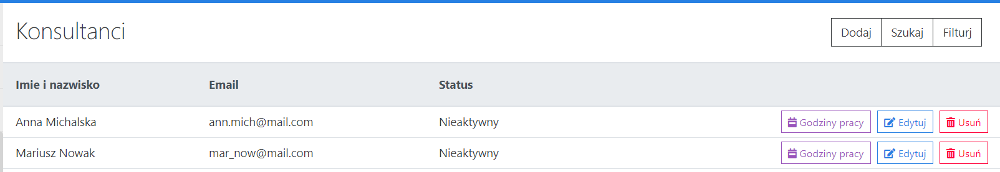

# HelpChat Client
Web application supporting the process of providing help to website visitors in real time. Visitors can have text conversations with an agent through a chat widget placed on the website. Agents use an application with a set of tools that give them knowledge about the visitor. <br>

Written in <b>Angular</b>. <b>Socket.io</b> <b>Bootstrap</b> were used in the project. HelpChat Server source code [HERE](https://github.com/Cailette/HelpChat-server).

- <a href="https://github.com/angular">Angular</a>
- <a href="https://github.com/twbs/bootstrap">Bootstrap</a>
- <a href="https://github.com/socketio/socket.io-client">Socket.io-client</a>
### Other:
- <a href="https://github.com/chartjs">Chartjs</a>
- <a href="https://github.com/auth0/angular-jwt/blob/master/README.md">Angular-jwt</a>
### External API:
- <a href="https://developer.here.com/documentation/geocoder/dev_guide/topics/what-is.html">HERE Geocoder API</a>
- <a href="https://developer.here.com/documentation/map-image/dev_guide/topics/what-is.html">HERE Map Image API</a>

Local install
-- 
1. `mkdir <folder_name>`
2. `cd <folder_name>`
3. `git clone https://github.com/Cailette/HelpChat-client.git` .
4. `npm install`
5. `npm start`
6. Run [server application](https://github.com/Cailette/HelpChat-server).
7. then load [http://localhost:4000/](http://localhost:4000/) in your browser to access the app.


Configuration
--
Configure by editing `./src/environments/environment.prod.ts` file with variables:
```
export const environment = {
  production: true,
  baseUrl: 'https://localhost:3000',
  hereAppID: <Your HERE Map Image API ID>,
  hereAppCode: <Your HERE Map Image API Code>,
  hereGeoCoderAppID: <Your HERE Geocoder API ID>,
  hereGeoCoderAppCode: <Your HERE Geocoder API code>'
};
```

Functionality
--
1.	Active-chat management by the agent and owner - access to the list of active chats, switching between chats, chatting and ending the chat. Displaying messages contained in the indicated chat and information about the visitor.
<p align="center">
    
</p>
<p align="center">
    
</p>
<p align="center">
    
</p>
2.	Activity status switching by the agent in order to declare readiness to provide help or finish work.
3.	Agent account management by the owner - adding, removing and editing accounts. Searching for a agent based on the name, surname or email by the owner.
<p align="center">
    
</p>
<p align="center">
    
</p>
<p align="center">
    
</p>
<p align="center">
    
</p>
<p align="center">
    
</p>
<p align="center">
    
</p>
4.	Archived-chats management by the owner and only owned chats by the agent - access to the list of ended chats, switching between chats, displaying messages contained in the indicated chat, but also information about the chat and information about the visitor. Deleting the chat and its messages by the owner. Searching for a chat based on the agent, date and rating by the owner.
<p align="center">
    
</p>
<p align="center">
    
</p>
<p align="center">
    
</p>
5.	Chat evaluation after disconnect with the agent by the visitor.
<p align="center">
    
</p>
6.	Chatting - visitor with agent.
<p align="center">
    
    
</p>
7.	Connection with the agent after clicking on the chat widget on the website by the visitor.
<p align="center">
    
    
</p>
8.	Displaying real-time list of the visitors on website by the agent and the owner.
<p align="center">
    
</p>
<p align="center">
    
</p>
9.	Informing about the number of new chats by the system.
<p align="center">
    
</p>
10.	Informing about the number of new messages by the system.
<p align="center">
    
    
</p>
11.	Logging in to the account as agent or owner by the user.
<p align="center">
    
</p>
<p align="center">
    
</p>
12.	Logging out of the system by the user.
13.	Registration in the system by the guest. After registration, the guest becomes the owner of a group of related accounts.
<p align="center">
    
</p>
<p align="center">
    
</p>
<p align="center">
    
</p>
14.	Sending an email to a randomly selected agent, when there are no active agents.
<p align="center">
    
    
</p>
15.	View account information by the user. (The first is the owner account, the second is the account and the agent interface.)
<p align="center">
    
</p>
<p align="center">
    
</p>
16.	Viewing the statistics of ended chats (i.e. the number and average rating of chats) by the owner. Viewing lists of agents activity times or working hours by the owner.
<p align="center">
    
</p>
<p align="center">
    
</p>
<p align="center">
    
</p>
<p align="center">
    
</p>
<p align="center">
    
</p>
<p align="center">
    
</p>
17.	Working hours management by the owner - adding and removing the working hours of the selected agent on a selected day of the week.
<p align="center">
    
</p>
<p align="center">
    
</p>